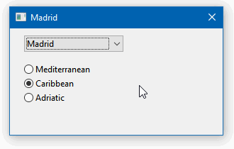

# 02 Combo and radios

This example showcases the `ComboBox` and the `RadioGroup` widgets. The `RadioGroup` is responsible for managing several `RadioButton` items.



To compile and run:

```
cargo run
```

To generate the final executable:

```
cargo build --release
```
