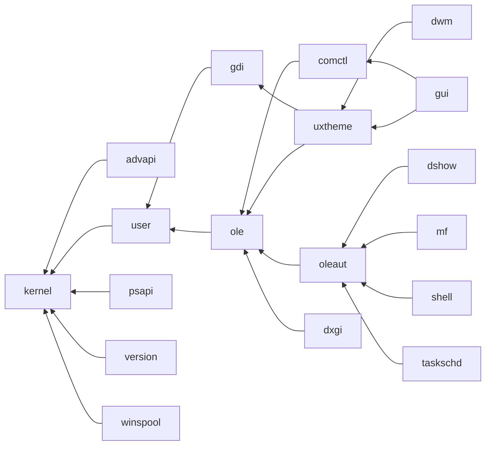

# Features chart

Dependency relationship of features available in `Cargo.toml`:

```mermaid
flowchart RL
    advapi --> kernel
    comctl --> ole
    dshow --> oleaut
    dwm --> uxtheme
    dxgi --> ole
    gdi --> user
    gui --> comctl
    gui --> uxtheme
    mf --> oleaut
    ole --> user
    oleaut --> ole
    psapi --> kernel
    shell --> oleaut
    taskschd --> oleaut
    user --> kernel
    uxtheme --> gdi
    uxtheme --> ole
    version --> kernel
    winspool --> kernel
```
